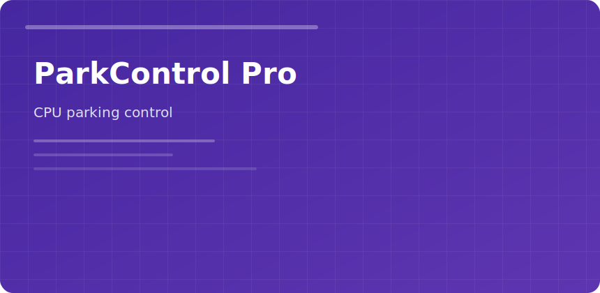

  

  

### ParkControl Pro

Windows hides **core parking** defaults that add latency in games, DAWs, and live coding sessions. ParkControl exposes parking, frequency scaling, and power plan glue.

#### Profiles

- **Performance** — unpark all cores
- **Balanced** — OEM-like defaults
- **Battery** — aggressive park on laptops

#### When it helps

| Symptom | Try |
|---------|-----|
| FPS dips | Performance profile |
| Audio crackle | Minimum cores parked 0 |
| Heat/noise | Partial park on HT threads |

Pair with Bitsum Process Lasso for automation rules per executable.

parkcontrol pro cpu parking performance windows bitsum
